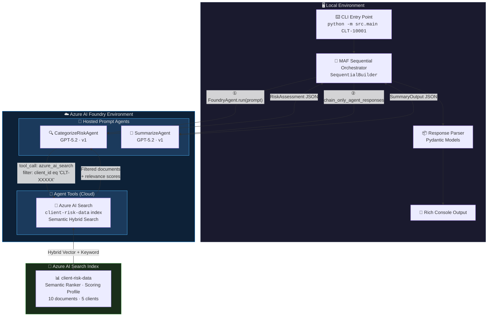
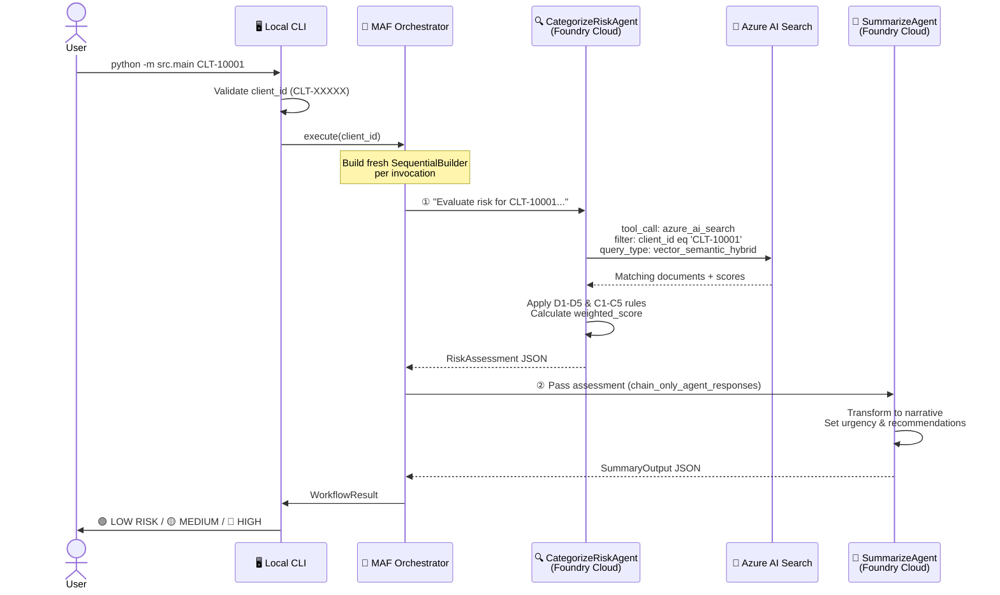

# 🤖 Risk Assessment Multi-Agent Workflow

> **A production-ready multi-agent system built on [Azure AI Foundry v2](https://learn.microsoft.com/azure/ai-studio/) and [Microsoft Agent Framework (MAF)](https://github.com/microsoft/agent-framework) that performs automated client risk assessments using cloud-hosted AI agents and Azure AI Search.**

[](#-prerequisites)
[](#-architecture-overview)
[](#-technology-stack)
[](#-technology-stack)

---

## 📋 Table of Contents

- [Overview](#-overview)
- [Architecture Overview](#-architecture-overview)
- [How It Works](#-how-it-works)
- [Technology Stack](#-technology-stack)
- [Key Components](#-key-components)
- [Azure AI Search Integration](#-azure-ai-search-integration)
- [Risk Scoring Engine](#-risk-scoring-engine)
- [Agent Output Contracts](#-agent-output-contracts)
- [Prerequisites](#-prerequisites)
- [Getting Started](#-getting-started)
- [Running the Sample](#-running-the-sample)
- [Test Data](#-test-data)
- [Testing](#-testing)
- [Project Structure](#-project-structure)
- [License](#-license)

---

## 🌟 Overview

This sample demonstrates a **sequential two-agent pipeline** that evaluates client risk profiles by combining **cloud-hosted Foundry agents** with **local Python orchestration**:

1. **🔍 CategorizeRiskAgent** — Queries Azure AI Search, evaluates compliance & discrepancy rules, and outputs a structured risk score (Low / Medium / High).
2. **📝 SummarizeAgent** — Transforms the technical risk assessment into a human-readable executive summary with actionable recommendations.

The local orchestrator chains these agents using MAF's `SequentialBuilder`, providing a clean separation between **orchestration logic** (local) and **AI reasoning** (cloud).

---

## 🏗️ Architecture Overview



### 🔑 Key Architecture Decisions

| Decision | Rationale |
|----------|-----------|
| **Local orchestration, cloud agents** | Keep orchestration logic testable and versionable locally; AI reasoning runs in Foundry's managed environment |
| **`chain_only_agent_responses=True`** | Only agent responses flow between stages — no conversation history bloat |
| **Fresh workflow per invocation** | Prevents conversation state leakage between separate risk assessments |
| **Search tool attached to agent in Foundry** | The AI Search tool runs server-side in Foundry, not locally — the agent autonomously invokes it |

---

## ⚙️ How It Works

### 🔄 End-to-End Workflow



### 🔎 How Azure AI Search Is Invoked

The search tool is **attached to the CategorizeRiskAgent at agent creation time** in Azure AI Foundry — it is **not** a local tool. Here's how it works:

1. **🏗️ Agent Creation** — The `create_agents.py` script registers an `azure_ai_search` tool on the CategorizeRiskAgent with the `client-risk-data` index configured for `vector_semantic_hybrid` queries.

2. **📨 Prompt Injection** — The local orchestrator sends a prompt containing the client ID:
   ```
   "Evaluate the risk profile for Client ID: CLT-10001.
    Query the knowledge base filtered by this Client ID..."
   ```

3. **🤖 Autonomous Tool Call** — The hosted GPT-5.2 model decides when to invoke the search tool. Foundry executes the tool call server-side with:
   ```
   filter: client_id eq 'CLT-10001'
   query_type: vector_semantic_hybrid
   ```

4. **📊 Filtered Results** — Azure AI Search returns only documents matching that exact `client_id`, preventing cross-client data leakage. Results include relevance scores from the semantic ranker and the `risk-boost` scoring profile.

5. **🧠 Rule Evaluation** — The agent analyzes the filtered documents against 10 rules (D1–D5 discrepancy + C1–C5 compliance) and calculates the weighted risk score.

> **💡 Important:** The local Python code never directly calls Azure AI Search. The search tool lives in the Foundry cloud and is invoked autonomously by the agent's LLM reasoning.

---

## 🛠️ Technology Stack

| Component | Technology | Version |
|-----------|-----------|---------|
| 🧠 **AI Model** | GPT-5.2 | Deployed in Foundry |
| 🤖 **Agent Framework** | Microsoft Agent Framework (MAF) | `agent-framework-foundry>=1.0.1` |
| ☁️ **Agent Hosting** | Azure AI Foundry v2 Prompt Agents | `kind="prompt"` |
| 🔗 **Azure SDK** | Azure AI Projects SDK | `azure-ai-projects>=2.0.0` |
| 🔐 **Authentication** | Azure Identity | `DefaultAzureCredential` |
| 🔎 **Knowledge Store** | Azure AI Search | Semantic Hybrid + Ranker |
| 📐 **Data Models** | Pydantic v2 | Schema validation |
| 🎨 **CLI Display** | Rich Console | Progress bars + panels |
| 🐍 **Runtime** | Python 3.10+ | Fully async (`asyncio`) |

---

## 🧩 Key Components

### 1️⃣ Local Orchestrator — MAF Sequential Workflow

The heart of the system is a **local Python orchestrator** using MAF's `SequentialBuilder`:

```python
from agent_framework.foundry import FoundryAgent
from agent_framework.orchestrations import SequentialBuilder

# Connect to pre-deployed Foundry hosted agents
categorize_agent = FoundryAgent(
    project_endpoint="https://foundry-cc-canada.services.ai.azure.com/api/projects/dev",
    agent_name="CategorizeRiskAgent",
    agent_version="1",
    credential=DefaultAzureCredential(),
)

summarize_agent = FoundryAgent(
    project_endpoint="https://foundry-cc-canada.services.ai.azure.com/api/projects/dev",
    agent_name="SummarizeAgent",
    agent_version="1",
    credential=DefaultAzureCredential(),
)

# Chain agents in a sequential pipeline
workflow = SequentialBuilder(
    participants=[categorize_agent, summarize_agent],
    chain_only_agent_responses=True,
).build()

result = await workflow.run("Evaluate risk for CLT-10001...")
```

### 2️⃣ Cloud Foundry Hosted Agents

Both agents are **prompt agents** (`kind="prompt"`) deployed in Azure AI Foundry:

| Agent | Model | Tools | Purpose |
|-------|-------|-------|---------|
| 🔍 **CategorizeRiskAgent** | GPT-5.2 | `azure_ai_search` | Risk analysis + scoring |
| 📝 **SummarizeAgent** | GPT-5.2 | None | Narrative transformation |

### 3️⃣ Error Handling & Resilience

```
WorkflowError (base)
├── AgentInvocationError    — Agent call failed
├── ContextHandoffError     — Inter-agent data transfer issue
├── ClientNotFoundError     — Client ID not found in search
└── InvalidClientIdError    — Format validation failed (expects CLT-XXXXX)
```

- 🔁 **Retry decorator** with exponential backoff for transient errors (`ConnectionError`, `TimeoutError`)
- ✅ **Cross-stage consistency checks** — Corrects mismatched `client_id` or `risk_score` between agents

---

## 🔎 Azure AI Search Integration

### Index: `client-risk-data`

| Field | Type | Filterable | Searchable | Purpose |
|-------|------|:----------:|:----------:|---------|
| `client_id` | String | ✅ | ✅ | **Primary filter** for all queries |
| `document_type` | String | ✅ | ✅ | KYC, Financial, Compliance, etc. |
| `compliance_status` | String | ✅ | — | current, expired, pending |
| `risk_flags` | Collection | ✅ | ✅ | kyc_expired, adverse_media, etc. |
| `document_content` | String | — | ✅ | Full text (English analyzer) |

### Search Configuration

- **🔍 Query Type:** `vector_semantic_hybrid` (keyword + vector + semantic ranking)
- **📊 Semantic Config:** `default-semantic` with title, content, and keyword fields
- **⚖️ Scoring Profile:** `risk-boost` — weights `risk_flags` (3.0×), `document_content` (2.0×), `notes` (1.5×)

---

## 📊 Risk Scoring Engine

### Severity Weights

| Severity | Weight | Examples |
|----------|:------:|---------|
| 🔴 **Critical** | 3 | Missing compliance docs, expired certifications, watchlist match |
| 🟡 **Major** | 2 | Conflicting records, outdated critical data |
| 🟢 **Minor** | 1 | Missing optional fields, formatting inconsistencies |

### Score Calculation

```
weighted_score = Σ (discrepancy_count × severity_weight)
```

| Weighted Score | Risk Level | Action |
|:--------------:|:----------:|--------|
| `0` | 🟢 **Low** | No action required |
| `1 – 5` | 🟡 **Medium** | Review suggested |
| `≥ 6` | 🔴 **High** | Immediate action required |

> ⚠️ **Conservative Escalation:** When uncertain, the agent escalates to a higher risk category.

### Rules Applied

| ID | Category | Rule |
|----|----------|------|
| D1 | Discrepancy | Missing required fields |
| D2 | Discrepancy | Data format inconsistency |
| D3 | Discrepancy | Cross-reference conflicts |
| D4 | Discrepancy | Outdated or stale data |
| D5 | Discrepancy | Duplicate or conflicting entries |
| C1 | Compliance | Mandatory documents exist |
| C2 | Compliance | Compliance dates current |
| C3 | Compliance | Certifications valid |
| C4 | Compliance | Regulatory requirements met |
| C5 | Compliance | Watchlist/flag indicators |

---

## 📄 Agent Output Contracts

<details>
<summary><strong>🔍 CategorizeRiskAgent → RiskAssessment</strong></summary>

```json
{
  "client_id": "CLT-10001",
  "risk_score": "Low",
  "weighted_score": 0,
  "discrepancy_count": 0,
  "search_results": [
    {
      "document_id": "doc-001",
      "relevance_score": 0.95,
      "content_summary": "KYC documentation is current and complete",
      "fields": {}
    }
  ],
  "rule_evaluations": [
    {
      "rule_id": "C1",
      "rule_name": "Mandatory compliance documents exist",
      "passed": true,
      "severity": "Critical",
      "details": "All required documents present"
    }
  ],
  "reasoning": "All compliance checks passed with no discrepancies detected."
}
```
</details>

<details>
<summary><strong>📝 SummarizeAgent → SummaryOutput</strong></summary>

```json
{
  "client_id": "CLT-10001",
  "risk_score": "Low",
  "summary_markdown": "## 🟢 LOW RISK — Acme Financial Services\n...",
  "summary_plain_text": "LOW RISK - Acme Financial Services...",
  "key_findings": [
    "All KYC documentation is current",
    "No compliance violations detected"
  ],
  "recommendations": [
    "Continue standard monitoring schedule",
    "Next review date: Q3 2026"
  ],
  "urgency_level": "routine",
  "generated_timestamp": "2026-04-15T05:47:00Z"
}
```
</details>

---

## ✅ Prerequisites

Before running this sample, ensure you have:

| Requirement | Details |
|-------------|---------|
| 🐍 **Python** | 3.10 or higher |
| ☁️ **Azure Subscription** | With Azure AI Foundry access |
| 🏗️ **Azure AI Foundry Project** | Provisioned with a GPT-5.2 model deployment |
| 🔎 **Azure AI Search** | Service with the `client-risk-data` index created |
| 🔐 **Azure CLI** | Logged in (`az login`) for local `DefaultAzureCredential` |
| 🤖 **Foundry Agents** | Both `CategorizeRiskAgent` and `SummarizeAgent` deployed |

---

## 🚀 Getting Started

### 1️⃣ Clone the Repository

```bash
git clone https://github.com/your-org/Foundy-v2-mas-workflow-sample.git
cd Foundy-v2-mas-workflow-sample/code
```

### 2️⃣ Create a Virtual Environment

```bash
python -m venv .venv

# Windows
.venv\Scripts\activate

# macOS/Linux
source .venv/bin/activate
```

### 3️⃣ Install Dependencies

```bash
pip install -r requirements.txt
```

### 4️⃣ Configure Environment Variables

```bash
cp .env.example .env
```

Edit `.env` with your Foundry project details:

```ini
FOUNDRY_ENDPOINT=https://foundry-cc-canada.services.ai.azure.com/api/projects/dev
CATEGORIZE_AGENT_NAME=CategorizeRiskAgent
CATEGORIZE_AGENT_VERSION=1
SUMMARIZE_AGENT_NAME=SummarizeAgent
SUMMARIZE_AGENT_VERSION=1
WORKFLOW_TIMEOUT_SECONDS=60
RETRY_COUNT=3
LOG_LEVEL=INFO
```

### 5️⃣ Authenticate with Azure

```bash
az login
```

### 6️⃣ One-Time Setup (if creating resources from scratch)

```bash
# Create the Azure AI Search index and upload sample data
python scripts/create_search_index.py

# Deploy the agents to Foundry
python scripts/create_agents.py
```

---

## ▶️ Running the Sample

### Basic Usage

```bash
# Run risk assessment for a client
python -m src.main CLT-10001
```

**Example Output:**
```
╭────────────────────────────────────────────────╮
│          Risk Assessment Complete               │
├────────────────────────────────────────────────┤
│ Client ID:  CLT-10001                           │
│ Risk Score: 🟢 LOW                              │
╰────────────────────────────────────────────────╯

## Risk Assessment Summary
**Client ID**: CLT-10001
**Risk Classification**: 🟢 LOW RISK
...
```

### JSON Output

```bash
# Get raw JSON output (for piping to other tools)
python -m src.main CLT-10001 --json
```

---

## 🧪 Test Data

Five pre-loaded test clients are available in the Azure AI Search index:

| Client ID | Company | Expected Risk | Key Characteristics |
|-----------|---------|:-------------:|---------------------|
| `CLT-10001` | Acme Financial Services | 🟢 **Low** | All compliant, current documentation |
| `CLT-20002` | GlobalTech Industries | 🟡 **Medium** | Ownership change pending, expiring cert |
| `CLT-30003` | Northern Trust Holdings | 🔴 **High** | Expired KYC, adverse media, regulatory investigation |
| `CLT-40004` | Maple Leaf Ventures | 🟢 **Low** | Minor revenue decline, otherwise compliant |
| `CLT-50005` | Pacific Rim Trading Co | 🔴 **High** | High-risk jurisdiction, unusual transactions |

---

## 🧪 Testing

All tests use mocked agents — **no Azure connectivity required**.

```bash
# Run full test suite
python -m pytest tests/ -v

# Run specific test class
python -m pytest tests/test_workflow.py::TestRiskAssessmentWorkflow -v

# Run with coverage
python -m pytest tests/ -v --cov=src
```

### Test Coverage

| Test File | What It Tests |
|-----------|---------------|
| `test_workflow.py` | Orchestrator logic, agent chaining, consistency checks |
| `test_models.py` | Pydantic model validation, client ID format regex |
| `test_config.py` | Environment variable loading, defaults |
| `test_errors.py` | Exception hierarchy, retry decorator behavior |
| `test_agents.py` | Code fence stripping helper |

---

## 📁 Project Structure

```
Foundy-v2-mas-workflow-sample/
│
├── 📄 README.md                          ← You are here
│
├── 📂 prompt-contracts/                  ← Agent design & specifications
│   ├── CATEGORIZE-RISK-AGENT.md          ← CategorizeRiskAgent prompt contract
│   ├── SUMMARIZE-AGENT.md                ← SummarizeAgent prompt contract
│   ├── ORCHESTRATION.md                  ← MAF orchestration patterns
│   ├── WORKFLOW-ARCHITECTURE.md          ← Architecture decisions
│   └── sample-data/
│       ├── client-risk-data.json         ← 10 sample documents (5 clients)
│       └── index-schema.json             ← AI Search index definition
│
└── 📂 code/                              ← Working implementation
    ├── src/
    │   ├── main.py                       ← CLI entry point
    │   ├── config.py                     ← Environment-driven configuration
    │   ├── errors.py                     ← Exception hierarchy + retry
    │   ├── progress.py                   ← Rich console progress display
    │   ├── agents/
    │   │   └── base_agent.py             ← Code fence stripping utility
    │   ├── workflow/
    │   │   ├── orchestrator.py           ← SequentialBuilder workflow
    │   │   └── context.py                ← WorkflowResult builder
    │   └── models/
    │       ├── input.py                  ← WorkflowInput (CLT-XXXXX regex)
    │       └── output.py                 ← Pydantic output schemas
    ├── tests/                            ← Full test suite (mocked agents)
    ├── scripts/
    │   ├── create_agents.py              ← Deploy agents to Foundry
    │   └── create_search_index.py        ← Create AI Search index
    ├── requirements.txt
    ├── pyproject.toml
    └── .env.example
```

---

## 📜 License

This project is provided as a sample for educational and demonstration purposes.

---

<p align="center">
  Built with ❤️ using <strong>Azure AI Foundry</strong> and <strong>Microsoft Agent Framework</strong>
</p>
