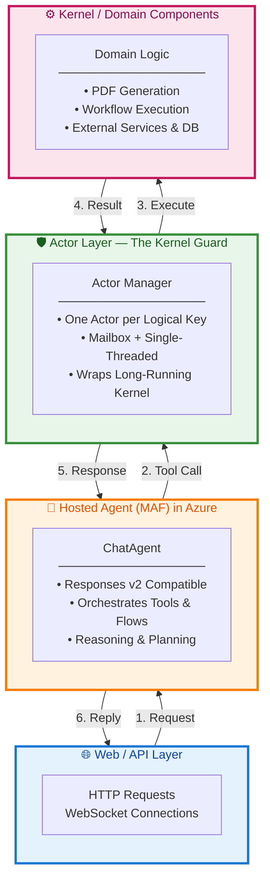
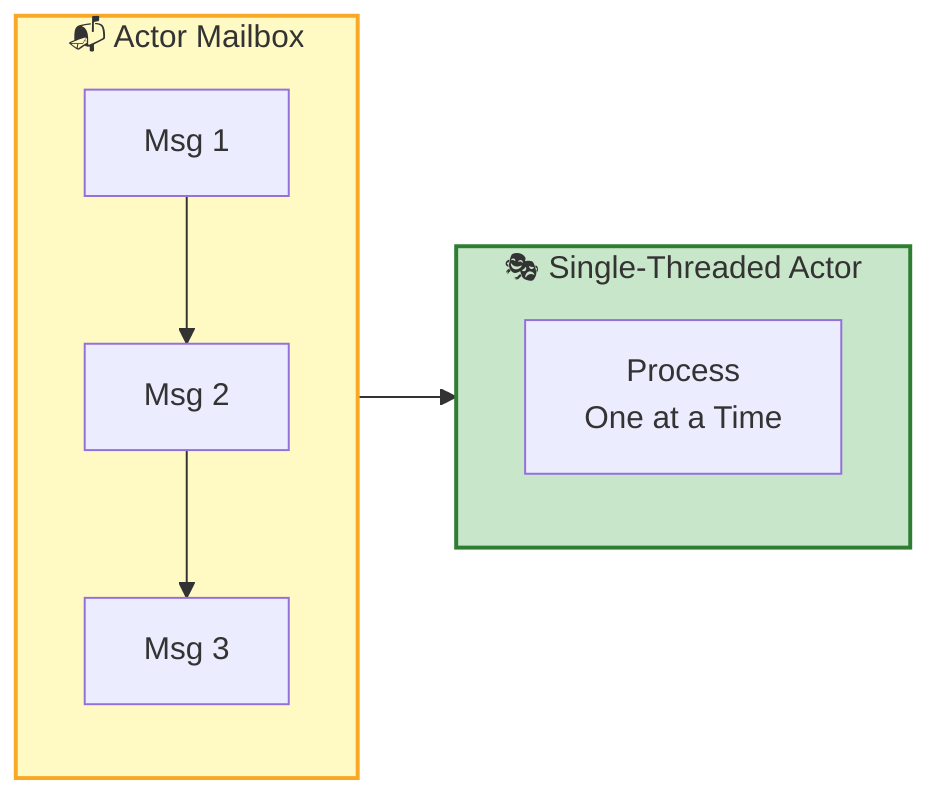
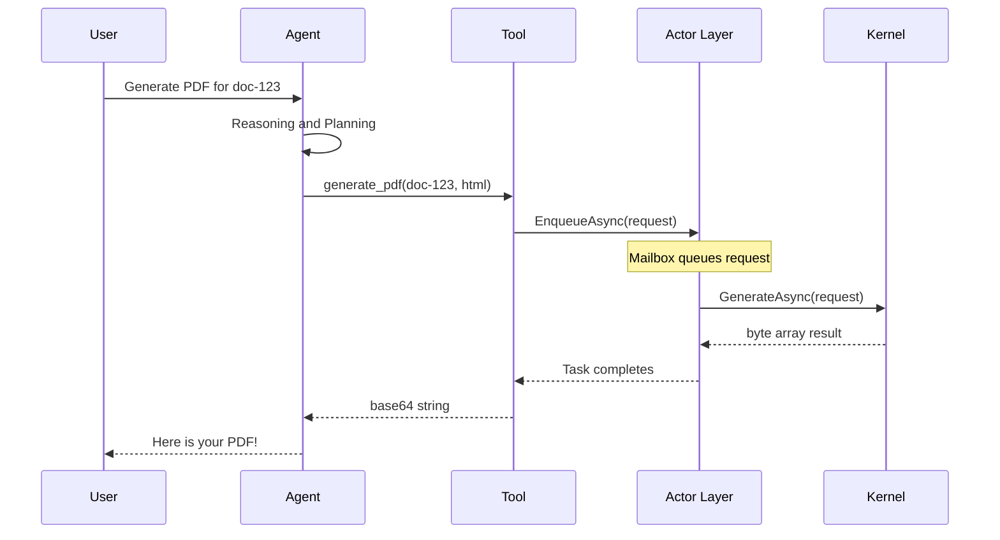
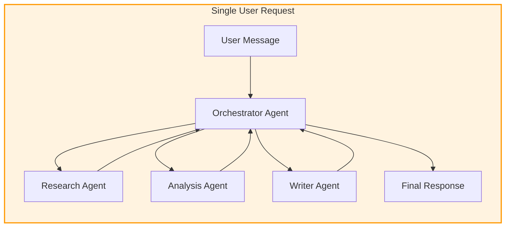
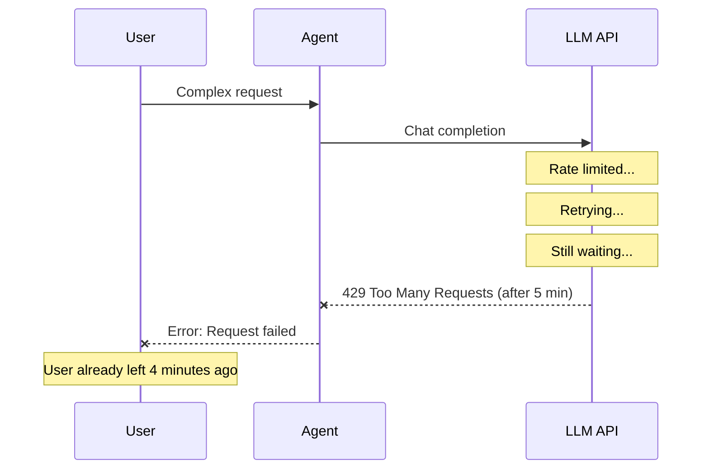
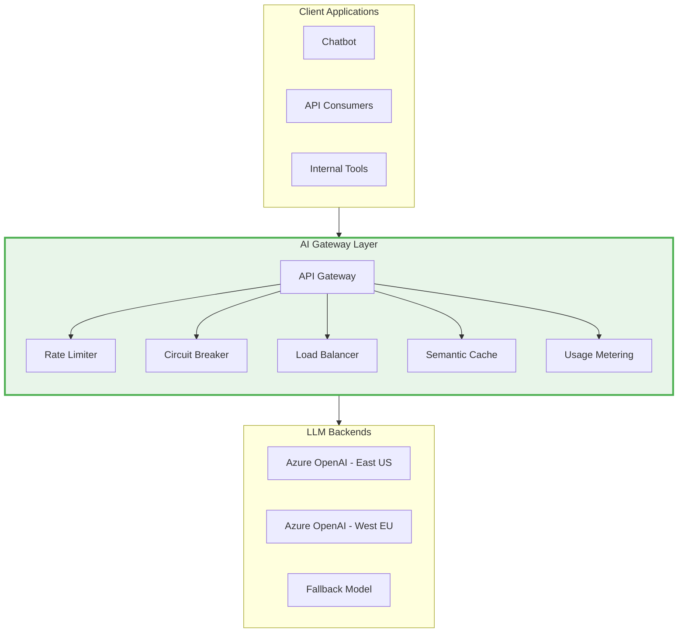

# Building Robust Long‑Running AI Agents with Microsoft Agent Framework, Azure Hosted Agents, and an Actor Pattern


> **TL;DR:** Most AI agent frameworks handle *reasoning* beautifully—but leave *execution safety* entirely up to you. This post shows how to combine Microsoft Agent Framework with a lightweight actor layer to build agents that actually survive production.

---

## The Problem Nobody Is Talking About

AI agents are everywhere right now—and most of them **fall apart** the moment you put real users, real concurrency, or real latency on them.

It's not because the frameworks are bad.  
It's because the engineering conversation around agents is **missing something fundamental:**

> *Modern AI engineers rarely think about concurrency, isolation, or fault tolerance—because most have never had to build systems where those things matter.*

If you've ever built telecom systems, trading engines, workflow orchestrators, or high‑load web services, you know exactly what I mean. You've lived through deadlocks at 2 AM. You've debugged race conditions that only appear under load. You've seen thread pools collapse under backpressure.

**Most of the AI ecosystem hasn't.**

And that's why the industry is currently obsessed with *"agentic reasoning"*, *"tool calling"*, and *"planning algorithms"*… while almost nobody is talking about how to **run agents safely** in a multi‑user, long‑running, stateful environment.

**This post fills that gap.**

---

## What We're Building

We'll combine three layers into a production-ready architecture:

| Component | Purpose |
|-----------|---------|
| **Microsoft Agent Framework (MAF)** | Agentic orchestration |
| **Azure AI Foundry Hosted Agents** | Managed hosting + Responses v2 endpoint |
| **Lightweight Actor Layer** | Isolation, ordering, and robustness |

This gives you the best of both worlds:

```
┌─────────────────────────────────────┐
│  🧠 Agents decide WHAT to do        │
├─────────────────────────────────────┤
│  🛡️ Actors ensure it happens SAFELY │
└─────────────────────────────────────┘
```

---

## Why This Pattern Matters (And Why Nobody Talks About It)

Before we dive into code, let's address the elephant in the room.

### 1️⃣ The AI Hype Cycle Rewards Novelty, Not Engineering Maturity

Everyone is chasing the next agent framework, the next planning algorithm, the next LLM trick.

**Nobody is chasing:**

| What Matters | Status |
|--------------|--------|
| Deterministic execution | ❌ Ignored |
| Concurrency correctness | ❌ Ignored |
| Isolation boundaries | ❌ Ignored |
| Supervision | ❌ Ignored |
| State safety | ❌ Ignored |

*Those things don't demo well.*

### 2️⃣ Most AI Engineers Have Never Built High‑Load Systems

The people building agent frameworks today are brilliant—but many come from:

- 📊 ML research  
- 📈 Data science  
- 🎨 Frontend  
- 🚀 Product prototyping  

They haven't lived through:

| Concurrency Nightmare | Pain Level |
|----------------------|------------|
| 🔥 Race conditions | Extreme |
| 🔒 Deadlocks | Severe |
| ⚠️ Thread starvation | High |
| 💥 Distributed state corruption | Critical |

So they don't *feel* the need for actor‑style concurrency.

### 3️⃣ LLMs Don't Understand Concurrency Hazards

LLMs can *describe* a deadlock, but they can't *experience* one.

So they default to:

- `async/await` everywhere
- Shared state by default
- Naive parallelism

They don't naturally generate actor‑style patterns unless you **force them**.

### 4️⃣ Agent Frameworks Orchestrate Reasoning, Not Execution

LangChain, Semantic Kernel, and Microsoft Agent Framework assume:

> *"The agent decides what to do."*

They do **not** assume:

> *"The agent must run safely under multi‑user load."*

**That's your job as the system architect.**

---

## The Theoretical Foundation: Why Actors?

The Actor Model isn't new—it was formalized in 1973 by Carl Hewitt. But its principles have never been more relevant than they are today for AI systems.

### 💡 Joe Armstrong on the Nature of Concurrent Systems

**Joe Armstrong**, creator of Erlang and one of the pioneers of fault-tolerant distributed systems, captured the essence perfectly in his PhD thesis:

> ### *"The world is concurrent. Things in the world don't share data. Things communicate with messages. Things fail."*
>
> — **Joe Armstrong**  
> *[Making Reliable Distributed Systems in the Presence of Software Errors](https://erlang.org/download/armstrong_thesis_2003.pdf)* (2003)

This single observation explains why shared-state concurrency is fundamentally at odds with how robust systems actually work—and why the actor model maps naturally to real-world distributed systems.

### 📚 Gul Agha's Formal Definition

**Gul Agha**, in his seminal MIT Press work, provided the formal definition that underlies every actor framework from Erlang to Orleans to Akka:

> ### *"An actor is a computational entity that, in response to a message it receives, can concurrently: send a finite number of messages to other actors; create a finite number of new actors; designate the behavior to be used for the next message it receives."*
>
> — **Gul Agha**  
> *[Actors: A Model of Concurrent Computation in Distributed Systems](https://apps.dtic.mil/dtic/tr/fulltext/u2/a157917.pdf)* (MIT Press, 1986)

These aren't just academic curiosities. They're the **engineering principles** that made Erlang power telecom switches with nine-nines reliability, and that now power Microsoft Orleans at Xbox-scale.

---

## The Architecture We Actually Need

Here's the shape that works in production:



### Separation of Concerns

| Layer | Responsibility | Guarantees |
|-------|---------------|------------|
| **🤖 Agent** | Reasoning & orchestration | Intent understanding |
| **🛡️ Actor** | Concurrency & isolation | Thread safety, ordering |
| **⚙️ Kernel** | Domain logic & I/O | Business correctness |

> **This is the same pattern** that made **Erlang**, **Orleans**, **Akka**, and **Service Fabric Reliable Actors** so successful—but now applied to AI agents.

---

## Implementing the Pattern (With Real Code)

Below is the implementation. Each component has a single responsibility.

### Step 1: Microsoft Agent Framework Hosted Agent

```csharp
// Program.cs - Agent Registration
builder.Services.AddSingleton<IChatClient>(sp =>
    new OpenAIChatClient(
        new Uri(endpoint),
        apiKey,
        modelId: "gpt-4o-mini"));

builder.Services.AddSingleton<ChatAgent>(sp =>
{
    var agent = new ChatAgent(
        sp.GetRequiredService<IChatClient>(),
        name: "kernel-agent",
        id: "kernel-agent",
        instructions: """
            You orchestrate backend operations.
            You NEVER perform long-running work yourself.
            You MUST call tools that route through the actor layer.
            """);

    agent.Tools.AddFromObject(sp.GetRequiredService<PdfTools>());
    return agent;
});

// Expose as Azure AI Foundry-compatible endpoint
app.MapOpenAIChatAPI("/responses", agentId: "kernel-agent");
```

> ✅ This gives you a fully hosted agent that Azure AI Foundry can run as a container.

---

### Step 2: The Kernel (Your Heavy, Long-Running Logic)

```csharp
public class PdfKernel : IPdfKernel
{
    public async Task<byte[]> GenerateAsync(PdfRequest request, CancellationToken ct)
    {
        // Simulate heavy PDF generation work
        await Task.Delay(TimeSpan.FromSeconds(5), ct);
        return Encoding.UTF8.GetBytes($"PDF for {request.DocumentId}");
    }
}
```

> 💡 The kernel knows nothing about concurrency. It just does its job.

---

### Step 3: The Actor Layer (The Concurrency Guard)

This is where the magic happens:

```csharp
public class Actor<TMessage>
{
    private readonly Channel<TMessage> _channel = Channel.CreateUnbounded<TMessage>();
    private readonly Func<TMessage, CancellationToken, Task> _handler;
    private readonly CancellationTokenSource _cts = new();

    public Actor(Func<TMessage, CancellationToken, Task> handler)
    {
        _handler = handler;
        _ = Task.Run(ProcessLoop);  // Single-threaded processing loop
    }

    public ValueTask EnqueueAsync(TMessage message)
        => _channel.Writer.WriteAsync(message, _cts.Token);

    private async Task ProcessLoop()
    {
        // Messages processed ONE AT A TIME, in order
        await foreach (var msg in _channel.Reader.ReadAllAsync(_cts.Token))
            await _handler(msg, _cts.Token);
    }
}
```

**What this guarantees:**



| Property | Guaranteed? |
|----------|------------|
| ✅ Serialized execution per key | Yes |
| ✅ No shared state | Yes |
| ✅ No race conditions | Yes |
| ✅ No deadlocks | Yes |
| ✅ No thread-pool starvation | Yes |

---

### Step 4: Actor Manager Keyed by Logical ID

```csharp
public class ActorManager
{
    private readonly ConcurrentDictionary<string, Actor<PdfWorkItem>> _actors = new();
    private readonly IPdfKernel _kernel;

    public Task<byte[]> EnqueueAsync(PdfRequest request)
    {
        var tcs = new TaskCompletionSource<byte[]>();
        
        // Get or create actor for this document
        var actor = _actors.GetOrAdd(
            request.DocumentId,
            _ => new Actor<PdfWorkItem>(HandleWorkAsync));

        _ = actor.EnqueueAsync(new PdfWorkItem(request, tcs));
        return tcs.Task;
    }

    private async Task HandleWorkAsync(PdfWorkItem item, CancellationToken ct)
    {
        try
        {
            var result = await _kernel.GenerateAsync(item.Request, ct);
            item.Completion.SetResult(result);
        }
        catch (Exception ex)
        {
            item.Completion.SetException(ex);
        }
    }
}
```

> 🔑 **Key insight:** All work for a given `DocumentId` is serialized through its dedicated actor.

---

### Step 5: Exposing the Actor Layer as a Tool

```csharp
public class PdfTools
{
    private readonly ActorManager _actorManager;

    public PdfTools(ActorManager actorManager) => _actorManager = actorManager;

    [Tool("generate_pdf")]
    [Description("Generates a PDF document from HTML content")]
    public async Task<string> GeneratePdfAsync(
        [Description("Unique document identifier")] string documentId, 
        [Description("HTML content to convert")] string html)
    {
        var bytes = await _actorManager.EnqueueAsync(new PdfRequest(documentId, html));
        return Convert.ToBase64String(bytes);
    }
}
```

### The Complete Flow



**This is the missing architecture.**

---

## The Other Thing Nobody Talks About: Token Economics at Scale

Here's what's conspicuously absent from every AI agent tutorial:

**What happens when 100 users hit your agent simultaneously?**

Most developers build agents that work perfectly for a single user in a demo, then watch them collapse spectacularly in production. The actor pattern handles *execution* safety—but there's a whole other dimension of safety that almost nobody discusses: **token economics and LLM capacity planning**.

### 🧮 Understanding Your Model's Constraints

Every model in your agentic flow has hard limits:

| Constraint | GPT-4o | GPT-4o-mini | Claude 3.5 | What It Means |
|------------|--------|-------------|------------|---------------|
| **Context Window** | 128K | 128K | 200K | Max tokens in conversation |
| **Max Output** | 16K | 16K | 8K | Max tokens per response |
| **TPM (Tokens/Min)** | Varies | Varies | Varies | Rate limit per deployment |
| **RPM (Requests/Min)** | Varies | Varies | Varies | Request rate limit |

**The problem:** When you compose agents into flows, these limits *compound*.

### 📊 The Compounding Problem

Consider a simple agentic chatbot flow:



**One user request might trigger:**

| Step | Tokens Consumed |
|------|-----------------|
| Orchestrator reasoning | ~2,000 |
| Research agent call | ~4,000 |
| Analysis agent call | ~3,000 |
| Writer agent call | ~5,000 |
| Final synthesis | ~2,000 |
| **Total per request** | **~16,000 tokens** |

Now multiply by concurrent users:

| Users | Tokens/Min | TPM Required | Typical Limit | Result |
|-------|------------|--------------|---------------|--------|
| 1 | 16K | 16K | 150K | ✅ Fine |
| 10 | 160K | 160K | 150K | ⚠️ Throttled |
| 50 | 800K | 800K | 150K | 💥 Cascading failures |
| 100 | 1.6M | 1.6M | 150K | 🔥 Complete collapse |

**This is why your chatbot works in demo and dies in production.**

### ⏱️ The 5-Minute Timeout Trap

Here's what typically happens without proper handling:



**The user waited 5 minutes for nothing.** This is unacceptable UX.

### 🛡️ Applying the Actor Pattern to the Orchestrator

The actor pattern isn't just for your kernel—it should wrap your entire orchestration layer:

```csharp
public class OrchestratorActor
{
    private readonly Channel<AgentRequest> _channel;
    private readonly SemaphoreSlim _concurrencyLimiter;
    private readonly TokenBudgetTracker _tokenBudget;
    private readonly CircuitBreaker _circuitBreaker;

    public OrchestratorActor(OrchestratorConfig config)
    {
        // Limit concurrent LLM calls based on your TPM budget
        _concurrencyLimiter = new SemaphoreSlim(config.MaxConcurrentRequests);
        _tokenBudget = new TokenBudgetTracker(config.TokensPerMinute);
        _circuitBreaker = new CircuitBreaker(config.FailureThreshold);
    }

    public async Task<AgentResponse> ProcessAsync(AgentRequest request, CancellationToken ct)
    {
        // 1. Check circuit breaker FIRST
        if (_circuitBreaker.IsOpen)
            return AgentResponse.ServiceUnavailable("System is recovering. Please retry.");

        // 2. Estimate token cost BEFORE calling
        var estimatedTokens = EstimateTokenCost(request);
        
        // 3. Check if we have budget
        if (!_tokenBudget.TryReserve(estimatedTokens))
            return AgentResponse.RateLimited("Capacity reached. Please wait.");

        // 4. Acquire concurrency slot with timeout
        if (!await _concurrencyLimiter.WaitAsync(TimeSpan.FromSeconds(5), ct))
            return AgentResponse.Queued("Request queued. You are #X in line.");

        try
        {
            using var cts = CancellationTokenSource.CreateLinkedTokenSource(ct);
            cts.CancelAfter(TimeSpan.FromSeconds(30)); // Hard timeout

            return await ExecuteWithRetryAsync(request, cts.Token);
        }
        catch (OperationCanceledException)
        {
            return AgentResponse.Timeout("Request took too long. Please try again.");
        }
        finally
        {
            _concurrencyLimiter.Release();
        }
    }
}
```

### 🚦 The Token Budget Tracker

Don't wait for the LLM to reject you—**track your own budget**:

```csharp
public class TokenBudgetTracker
{
    private readonly int _tokensPerMinute;
    private readonly Queue<(DateTime Time, int Tokens)> _usage = new();
    private readonly object _lock = new();

    public TokenBudgetTracker(int tokensPerMinute)
    {
        _tokensPerMinute = tokensPerMinute;
    }

    public bool TryReserve(int tokens)
    {
        lock (_lock)
        {
            PruneOldEntries();
            
            var currentUsage = _usage.Sum(u => u.Tokens);
            if (currentUsage + tokens > _tokensPerMinute)
                return false;

            _usage.Enqueue((DateTime.UtcNow, tokens));
            return true;
        }
    }

    private void PruneOldEntries()
    {
        var cutoff = DateTime.UtcNow.AddMinutes(-1);
        while (_usage.Count > 0 && _usage.Peek().Time < cutoff)
            _usage.Dequeue();
    }
}
```

### 🔌 Circuit Breaker for LLM Calls

When the LLM is struggling, **stop hammering it**:

```csharp
public class LlmCircuitBreaker
{
    private int _failureCount;
    private DateTime? _openedAt;
    private readonly int _threshold;
    private readonly TimeSpan _recoveryTime;

    public bool IsOpen => _openedAt.HasValue && 
        DateTime.UtcNow - _openedAt.Value < _recoveryTime;

    public void RecordSuccess()
    {
        Interlocked.Exchange(ref _failureCount, 0);
        _openedAt = null;
    }

    public void RecordFailure()
    {
        if (Interlocked.Increment(ref _failureCount) >= _threshold)
            _openedAt = DateTime.UtcNow;
    }
}
```

### 🎛️ AI Gateway: The Missing Infrastructure Layer

For production systems, you need an **AI Gateway** between your agents and the LLM:



**Key capabilities:**

| Capability | What It Does | Why It Matters |
|------------|--------------|----------------|
| **Rate Limiting** | Enforces TPM/RPM limits | Prevents 429 cascades |
| **Circuit Breaker** | Stops calls when failing | Prevents retry storms |
| **Load Balancing** | Spreads across deployments | Maximizes throughput |
| **Semantic Caching** | Caches similar queries | Reduces costs 30-50% |
| **Fallback Routing** | Routes to backup models | Ensures availability |
| **Usage Metering** | Tracks per-user consumption | Enables chargeback |

### 🏗️ Azure API Management for AI Gateway

```csharp
// apim-policy.xml - AI Gateway Policy
<policies>
    <inbound>
        <!-- Rate limit by subscription -->
        <rate-limit-by-key 
            calls="100" 
            renewal-period="60" 
            counter-key="@(context.Subscription.Id)" />
        
        <!-- Token-based rate limiting -->
        <azure-openai-token-limit 
            tokens-per-minute="150000" 
            counter-key="@(context.Subscription.Id)" />
        
        <!-- Circuit breaker -->
        <retry condition="@(context.Response.StatusCode == 429)" 
               count="3" 
               interval="10" 
               first-fast-retry="false" />
    </inbound>
    
    <backend>
        <!-- Load balance across deployments -->
        <set-backend-service 
            backend-id="@(SelectLeastLoadedBackend())" />
    </backend>
</policies>
```

### 📋 The Holding Pattern: Graceful Degradation

When capacity is exceeded, **don't fail—queue gracefully**:

```csharp
public class GracefulAgentQueue
{
    private readonly Channel<QueuedRequest> _waitingRoom;
    private readonly int _maxQueueDepth;

    public async Task<AgentResponse> EnqueueOrRejectAsync(
        AgentRequest request, 
        CancellationToken ct)
    {
        // Check queue depth
        if (_waitingRoom.Reader.Count >= _maxQueueDepth)
        {
            return AgentResponse.Rejected(
                "System at capacity. Please try again in a few minutes.",
                retryAfter: TimeSpan.FromMinutes(2));
        }

        var queuedRequest = new QueuedRequest(request);
        await _waitingRoom.Writer.WriteAsync(queuedRequest, ct);

        // Return position in queue for UX
        return AgentResponse.Queued(
            $"Request queued. Position: {_waitingRoom.Reader.Count}",
            estimatedWait: EstimateWaitTime());
    }
}
```

### ✅ The Complete Production Checklist

Before deploying your agentic system, verify:

| Category | Checkpoint | Status |
|----------|------------|--------|
| **Model Awareness** | Know context window of each model | ⬜ |
| **Model Awareness** | Know max output tokens | ⬜ |
| **Model Awareness** | Know TPM/RPM limits per deployment | ⬜ |
| **Capacity Planning** | Calculate tokens per user request | ⬜ |
| **Capacity Planning** | Calculate max concurrent users | ⬜ |
| **Capacity Planning** | Plan for 3x peak capacity | ⬜ |
| **Resilience** | Implement request timeouts (< 30s) | ⬜ |
| **Resilience** | Implement circuit breaker | ⬜ |
| **Resilience** | Implement graceful queue/rejection | ⬜ |
| **Gateway** | Deploy AI Gateway (APIM, etc.) | ⬜ |
| **Gateway** | Configure rate limiting | ⬜ |
| **Gateway** | Configure fallback routing | ⬜ |
| **Observability** | Track token usage per request | ⬜ |
| **Observability** | Alert on capacity thresholds | ⬜ |

---

## Why This Pattern Is the Relevant

As AI systems move from demos to production, the industry will rediscover what systems engineers have known for decades:

| Principle | Beats |
|-----------|-------|
| 🏛️ **Isolation** | Cleverness |
| 🎯 **Determinism** | Optimism |
| 🎭 **Actors** | Threads |
| 👁️ **Supervision** | Debugging |
| 🧱 **Boundaries** | Assumptions |
| ⏱️ **Fast Failures** | Long Timeouts |
| 📊 **Capacity Planning** | Hope |

Most AI engineers haven't had to think about these things yet—but they will.

The combination of:
- **Actor patterns** for execution safety
- **Token budget tracking** for capacity management
- **Circuit breakers** for resilience
- **AI Gateways** for infrastructure

...is what separates a demo that impresses in a meeting from a system that survives Black Friday.

And when the industry catches up, the patterns you're using here will become the **standard way** to build safe, scalable, multi‑user agentic systems.

---

## Key Takeaways

1. **Agent frameworks handle reasoning**, not execution safety
2. **The Actor Model** provides mathematically-proven concurrency guarantees
3. **Separation of concerns** between agents, actors, and kernels creates maintainable systems
4. **Token economics compound** — one user's flow can consume 10K+ tokens; multiply by concurrent users
5. **Fail fast, not slow** — 30-second timeouts beat 5-minute failures every time
6. **AI Gateways are essential** — rate limiting, circuit breakers, and fallback routing aren't optional in production
7. **Know your models** — context windows, output limits, and TPM/RPM constraints determine your actual capacity

---

## Further Reading

- 📖 [Joe Armstrong's PhD Thesis](https://erlang.org/download/armstrong_thesis_2003.pdf) - The definitive work on fault-tolerant distributed systems
- 📖 [Gul Agha's Actor Model Book](https://apps.dtic.mil/dtic/tr/fulltext/u2/a157917.pdf) - The formal foundation
- 📖 [Microsoft Orleans Documentation](https://learn.microsoft.com/en-us/dotnet/orleans/) - Actors at scale
- 📖 [Microsoft Agent Framework](https://github.com/microsoft/agents) - The agent layer
- 📖 [Azure API Management for OpenAI](https://learn.microsoft.com/en-us/azure/api-management/api-management-authenticate-authorize-azure-openai) - AI Gateway patterns
- 📖 [Azure OpenAI Quotas and Limits](https://learn.microsoft.com/en-us/azure/ai-services/openai/quotas-limits) - Know your constraints
- 📖 [Circuit Breaker Pattern](https://learn.microsoft.com/en-us/azure/architecture/patterns/circuit-breaker) - Resilience fundamentals
